# CSS to the Rescue @cmda-minor-web 2022 - 2023
 

## Project – Rollercoaster 🎢 🪱

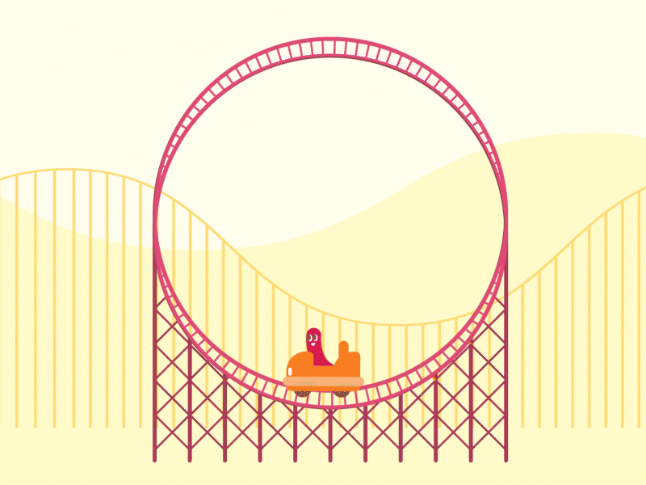

Introductie Css to the rescue

Wij vinden het web fascinerend. De laatste jaren is CSS een volwassen en zeer krachtige taal geworden (niet langer een bottleneck - integendeel). Veel van de (nieuwe) **CSS-lekkernijen** worden echter nog niet ten volle benut. Sommige delen van de spec worden onterecht (nog) niet bemind, andere delen zijn zo groot en complex dat we mogelijkheden nog niet hebben doorgrond. Aan jou de mooie opdracht om de onontgonnen delen van de CSS-wereld in kaart te brengen.

**In dit vierweekse vak ga je experimenteren met (voor jou) nieuwe CSS technieken - om daarna/mee een innovatieve, experimentele én aangename ervaring te creëren - met alleen vanilla HTML en vanilla CSS (frameworks, preprocessors, libraries en JavaScript zijn niet toegestaan).**

Goed om te weten: Het experiment wordt gewaardeerd - zelfs/zeker als het niet (helemaal) lukt. Voel je vrij om verder te gaan dan de CSS-technieken die je al beheerst.

## Dingen om vooraf te doen
- 🔱 **Fork** deze repository.
- ✅ [**Enroll** je voor de minor via de courselector](https://icthva.sharepoint.com/sites/courseselector#/CourseSelector/web-design-and-development/2022-2023) (dan kun je je werk straks ook op [DLO](https://dlo.mijnhva.nl/d2l/home/456154) opleveren).
- 📒 **Bekijk** het [programma](https://cmda-minor-web.github.io/css-to-the-rescue-2223/files/CSSttR-2223-Kick-off.pdf) (pdf 51MB), [het quizje](https://cmda-minor-web.github.io/css-to-the-rescue-2223/files/CSSttR-2223-Selector-Quizje.pdf) en de [kennismakingsoefening](https://cmda-minor-web.github.io/css-to-the-rescue-2223/oefening.html) alvast even.

## Opdrachten
Het vak bestaat uit:
- [Een kennismakingsoefening](https://cmda-minor-web.github.io/css-to-the-rescue-2223/oefening.html)
- [De eindopdracht](https://cmda-minor-web.github.io/css-to-the-rescue-2223/index.html)

De [beoordelingscriteria voor de eindopdracht](https://cmda-minor-web.github.io/css-to-the-rescue-2223/beoordelingsformulier.html) op een rijte.

## Themasessies
Schrijf je in het [CSSttR channel](https://teams.microsoft.com/l/channel/19%3acb82166dd12f4702a8c3b130b60ee873%40thread.tacv2/04%2520CSS%2520to%2520the%2520Rescue?groupId=c8b97eb6-ad53-4531-ad66-5c3c6297951c&tenantId=0907bb1e-21fc-476f-8843-02d09ceb59a7) bij 'Files' in de 'Indeling en Planning' Excel in voor zowel woensdag als donderdag in voor een themasessie naar je keuze (1 per dag):
- [Materiaal voor de themasessies](https://cmda-minor-web.github.io/css-to-the-rescue-2223/themas.html)

## Programma
Het vak beslaat 4 weken. Bekijk de [kick-off presentatie](https://cmda-minor-web.github.io/css-to-the-rescue-2223/files/CSSttR-2223-Kick-off.pdf) (pdf 48MB). 

In Teams vind je het [CSSttR channel](https://teams.microsoft.com/l/channel/19%3acb82166dd12f4702a8c3b130b60ee873%40thread.tacv2/04%2520CSS%2520to%2520the%2520Rescue?groupId=c8b97eb6-ad53-4531-ad66-5c3c6297951c&tenantId=0907bb1e-21fc-476f-8843-02d09ceb59a7) bij 'Files' de Excel met de 'Indeling en Planning'. Daar schrijf je je ook in voor themasessies en het eindgesprek.

Colleges, lessen en gesprekken vinden plaats in het TTH (4e verdieping :-).

## Docenten
- Vasilis van Gemert
- Sanne 't Hooft

## Leerdoelen
- Je kunt experimenteren met (voor jou) nieuwe css-technieken - om de mogelijkheden op waarde te schatten en te gebruiken waar gepast.
- Je hebt begrip van de volle kracht en mogelijkheden van CSS. Je laat zien dat CSS meer kan dan allen web pages 'stylen'.
- Je hebt begrip van de interactie-technieken van CSS (en HTML). De UX is aangenaam bruikbaar binnen de gekozen context(en).
- Je hebt begrip hoe progressive enhancement elegant toe te passen. Je laat zien dat je cascade, inheritance en specificity kunt toepassen.

## De Selector First CSS & No JS aanpak
Het **eerste uitgangspunt** is dat je *geen* ID's en classes gebruikt. Niet omdat ze niet nuttig zijn, maar om te oefenen met de [vele CSS selectoren](https://css-tricks.com/almanac/) die je tot je beschikking hebt. ID's mag je alleen gebruiken om de :target selector te triggeren en uiteraard om labels te koppelen aan inputs. En als het echt echt echt niet anders kan, heb je permissie om een enkele class toe te voegen.

Een **tweede uitgangspunt** is dat je *geen* JavaScript gebruikt. Als iets niet kan met CSS, dan zal je iets anders moeten verzinnen om te maken. We onderzoeken de mogelijkheden van CSS in dit vak, en niet die van JS.

# Procesverslag
Markdown is een simpele manier om HTML te schrijven.  
Markdown cheat cheet: [Hulp bij het schrijven van Markdown](https://github.com/adam-p/markdown-here/wiki/Markdown-Cheatsheet).

Nb. De standaardstructuur en de spartaanse opmaak van de README.md zijn helemaal prima. Het gaat om de inhoud van je procesverslag. Besteedt de tijd voor pracht en praal aan je website.

Nb. Door *open* toe te voegen aan een *details* element kun je deze standaard open zetten. Fijn om dat steeds voor de relevante stuk(ken) te doen.

## Jij

Van wie is dit procesverslag ?

### Auteur:
Danian Marengo

#### Case:
Bedieningspaneel
 

## Mijn plan

Mijn plan

### Je opdracht:
Bedieningspaneel.

#### Inspiratie: 
 
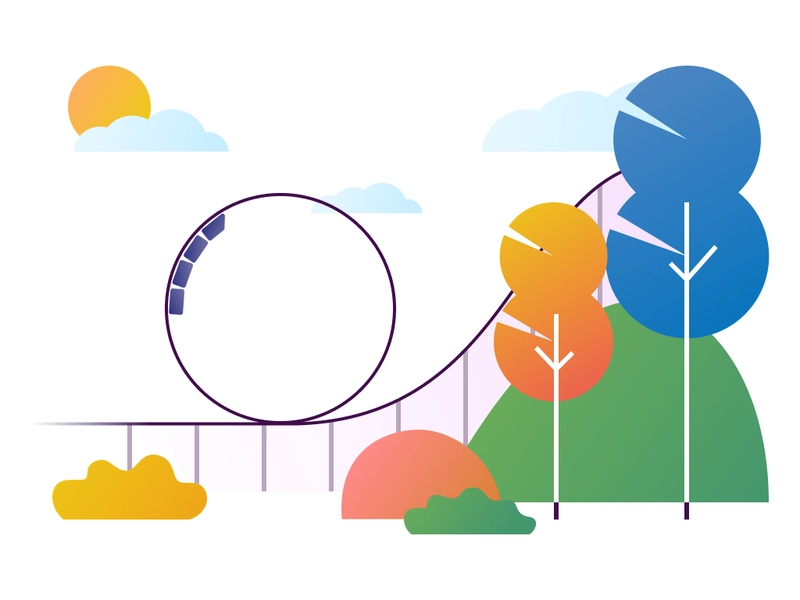

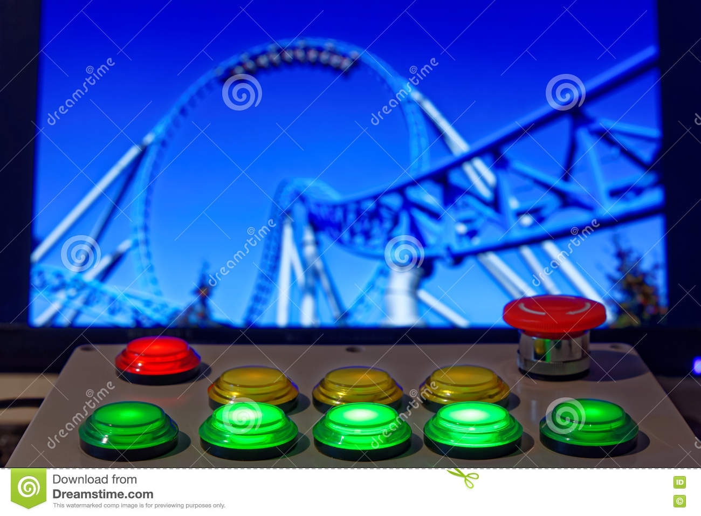

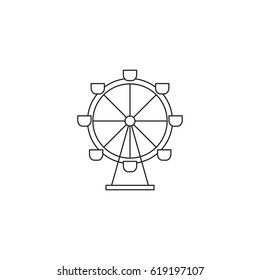

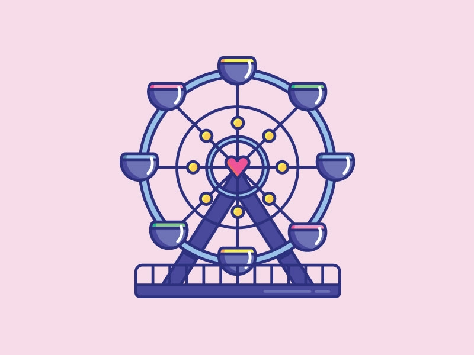

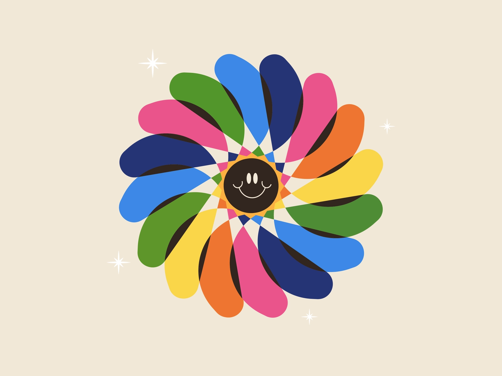

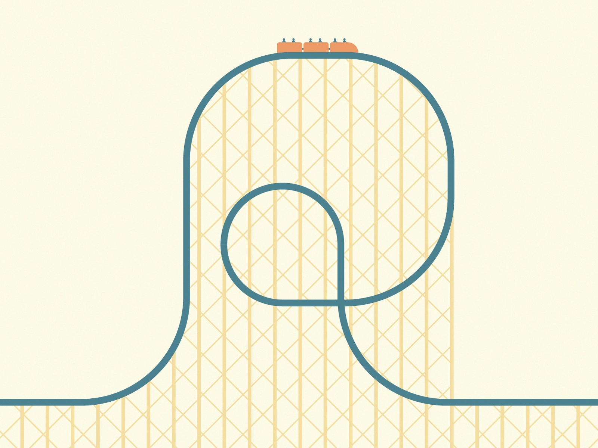

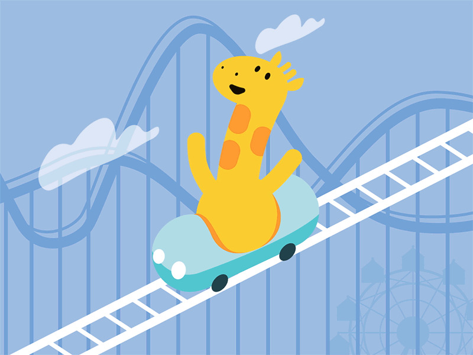

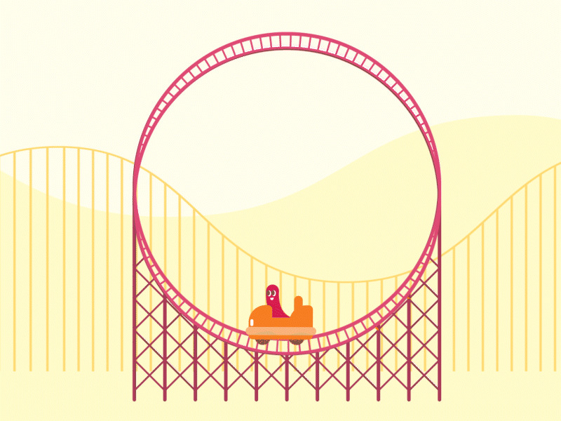
   

## Breakdownschets, Week 1

Breakdownschets

Uploaden vanuit schetsboek ..

### De hele pagina: 

### dynamisch deel (bijv menu): 

### wellicht nog een dynamisch deel (bijv filter): 

## Voortgang 1

Voortgang 1, week 2

### Stand van zaken

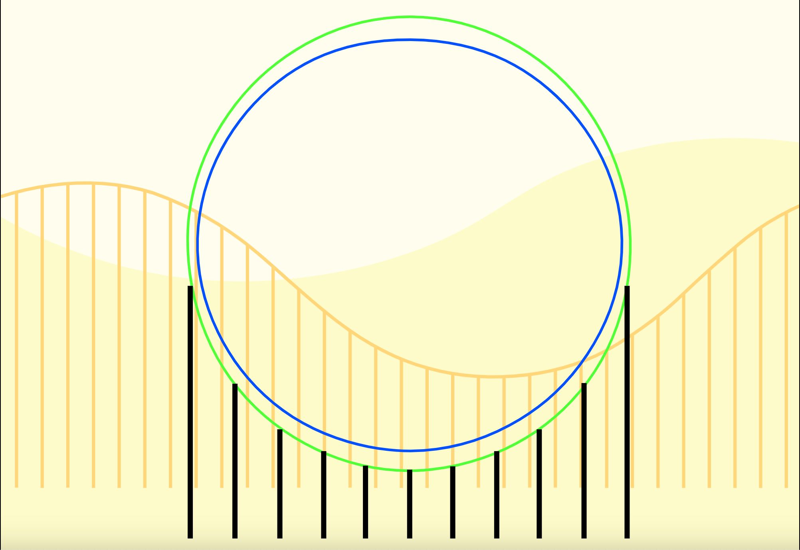
 

### Agenda voor meeting

<table>
  <tr>
   <th>Danian</th>
   <th>Max</th>
   <th>Salwa</th>
   <th>Stein</th>
   <th>Tristan</th>
  </tr>
  <tr>
   <td>Vraag 1</td>
   <td>Vraag 1</td>
   <td>vraag 1</td>
   <td>Vraag 1</td>
   <td>vraag 1</td>
  </tr>
  <tr>
   <td>Vraag 2</td>
   <td>Vraag 2</td>
   <td>vraag 2</td>
   <td>Vraag 2</td>
   <td>vraag 2</td>
  </tr>

  <tr>
   <td>Vraag 3</td>
   <td>Vraag 3</td>
   <td>vraag 3</td>
   <td>Vraag 3</td>
   <td>vraag 3</td>
  </tr>
</table>

### Verslag van meeting
 

## Voortgang 2

Voortgang 2

### Stand van zaken
Waar ik nu sta.

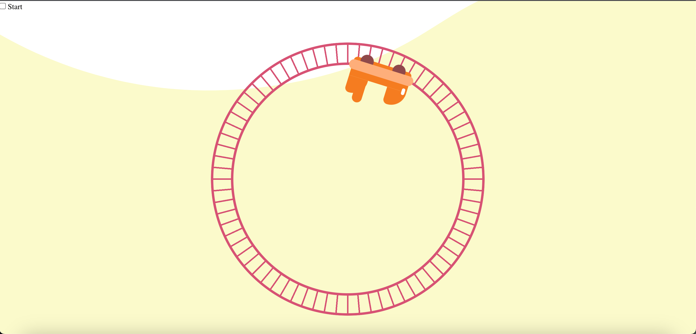

 

### Hindernissen
Het idee was om met <a href="https://developer.mozilla.org/en-US/docs/Web/CSS/CSS_Motion_Path">Css Motion Path</a> een "achtbaan karretje" opgebouwd uit HTML elementen, te animeren over een SVG in de vorm van een looping. Dit was in gedachte 🧠 een perfect idee. Hierdoor kon ik namelijk in Illustrator het pad van de achtbaan tekenen en zou ik bijvoorbeeld een 🥚 vormige looping 🎢 of een kurketrekker kunnen maken waar het achtbaan karretje ✨ perfect ✨ over animeert. 

<strong>Helaas!</strong> ondanks dat de kracht van een SVG is, dat deze responsive is. Krijgt deze in CSS een gefixeerde waarde, waardoor het object wat je animeert op het pad, eigenlijk compleet uit koers raakt, tenzij je een SVG in een SVG animeert 💀. <!-- Voorbeeld toevoegen --> Nu zijn daar meerdere <a href="https://css-tricks.com/create-a-responsive-css-motion-path-sure-we-can/">oplossingen</a> voor, alleen zijn deze niet efficiënt of 🚫 verboden 🚫 bij dit vak, aangezien hier 🙅🏾‍♂️ JavaScript 👎🏾 voor nodig is.

 

### Wat heb ik geleerd?
Dat CSS Motion Path, enorm krachtig is en kan zijn voor de toekomst van animeren met CSS. Alleen in zijn huidige staat niet zijn volledige potentie behaald.

 

### Oplossing
Eerder heb ik samen met <a href="https://www.sinds1971.nl/">Sanne</a> een object geanimeerd in een cirkel, wat in principe de basis vormt van de looping die ik wil maken. Hoofdpijn 🤕, frustratie 🤬 en een ervaring 🤩 rijker ben ik vanuit daar verdergegaan en laat ik <a href="https://developer.mozilla.org/en-US/docs/Web/CSS/CSS_Motion_Path">Css Motion Path</a> voor het maken van de achtbaan éven buiten beeld. 

 

### Waar ik trots op ben
Ik hou ervan om mezelf uit te dagen tijdens 🧪 experimenteren 🧑🏾‍🏫. Zodra ik me niet helemaal op mijn gemak 😰 voel tijdens het werken met iets wat compleet nieuw voor mij is, weet ik dat ik goed opweg ben 🙌🏾. Na het werken met SVG's, had ik voor de makkelijke route kunnen gaan en mijn looping in Adobe Illustrator creëren en deze vervolgens als SVG exporteren en implementeren in mijn website. Alleen heb ik ervoor gekozen om deze op te bouwen 👷🏾‍♂️ met <a href="https://developer.mozilla.org/en-US/docs/Web/CSS/CSS_Images/Using_CSS_gradients">CSS Gradients</a> en gebruik te maken van iets waar ik nooit eerder gebruik van heb gemaakt in CSS, namelijk <a href="https://developer.mozilla.org/en-US/docs/Web/CSS/mask">CSS Masks</a> 🏆.

### Agenda voor meeting
Samen met groep opstellen.

<table>
  <tr>
   <th>Danian</th>
   <th>Max</th>
   <th>Salwa</th>
   <th>Stein</th>
   <th>Tristan</th>
  </tr>
  <tr>
   <td>Vraag 1</td>
   <td>Vraag 1</td>
   <td>vraag 1</td>
   <td>Vraag 1</td>
   <td>vraag 1</td>
  </tr>
  <tr>
   <td>Vraag 2</td>
   <td>Vraag 2</td>
   <td>vraag 2</td>
   <td>Vraag 2</td>
   <td>vraag 2</td>
  </tr>

  <tr>
   <td>Vraag 3</td>
   <td>Vraag 3</td>
   <td>vraag 3</td>
   <td>Vraag 3</td>
   <td>vraag 3</td>
  </tr>
</table>

### Verslag van meeting
Na aflooop

## Voortgang 4

Voortgang 4

 

## Voortgang 3 (week 4)

Voortgang 3

### Stand van zaken
 

### Agenda voor meeting
samen met je groepje opstellen

### Verslag van meeting

## Eindgesprek (week 5)

uitwerken voor eindgesprek

### Stand van zaken
 
 
### Screenshot(s)

 Screenshots van mijn eindresultaat 

 

## Bronnenlijst

Gebruikte bronnen

